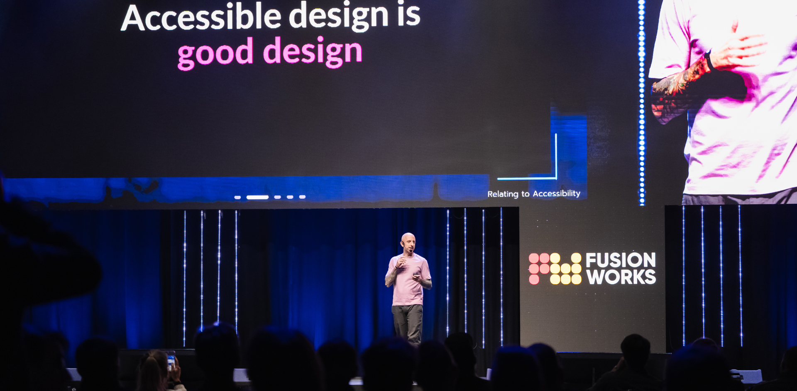

## Hey y'all, I'm Daniel 🤘

> Lead Design Systems Developer, Accessibility Advocate, Tech Speaker, Horror Author, Mentor, Wannabe Explorer

Daniel Yuschick brings over 15 years of experience at the intersection of design and development, specializing in creating accessible and resilient design systems. Starting as a designer and transitioning to frontend development, Daniel has taken on Lead Design Systems Developer roles where he thrives on bridging the gaps between design and code while focusing on the aspects of the web he loves most. He contributes technical articles to various online publications like [Smashing Magazine](https://www.smashingmagazine.com/author/daniel-yuschick/), [CSS Tricks](https://css-tricks.com/author/danyuschick/) and [LogRocket](https://blog.logrocket.com/author/danielyuschick/) and mentors aspiring developers through the Helsinki-based non-profits [CodeBar](https://codebar.io/) and [Hive Helsinki](https://www.hive.fi/en). Beyond the technical, Daniel is a fiction [author](https://www.amazon.com/stores/Daniel-Yuschick/author/B07RZWNCSY?ref=dbs_a_mng_rwt_scns_share&isDramIntegrated=true&shoppingPortalEnabled=true) with a passion for engaging storytelling, great chocolate, and beautiful tattoos.

### Speaking

| Date       | Event               | Location |  Title                                                      |
| ---------- | ------------------- | -------- | ----------------------------------------------------------- |
| 06.02.2025 | TampereJS             | Tampere, FI  |  It's Alive! Facing The Monsters of Accessible Live Regions |
| 27.02.2025 | axe-con             | Virtual  |  It's Alive! Facing The Monsters of Accessible Live Regions |
| 26.03.2025 | Turku ❤️ Frontend              | Turku, FI       | TBA              |
| 21.05.2025 | NDC Oslo | Oslo, NO  |  Building Better Components — A Journey to a More Resilient Frontend  |
| 28.05.2025 | Into Design Systems | Virtual  |  TBA                                                        |
| 03-05.06.2025 | Webinale             | Berlin, DE  |  Approach With Care - Making Digital Accessibility Feel Natural |
| 10-11.10.2025 | Moldova DevCon             | Chișinău, MD  |  TBA - Workshop |

### Past Speaking Events

| Date       | Event                          | Location        |  Title                                                               |
| ---------- | ------------------------------ | --------------- | -------------------------------------------------------------------- |
| 18.12.2024 | Turku ❤️ Frontend              | Turku, FI       | Beyond JavaScript - Building UIs With Modern HTML & CSS              |
| 05.12.2024 | Posti TechCon                  | Helsinki, FI    |  Approach With Care - Making Digital Accessibility Feel Natural      |
| 15.11.2024 | Build Stuff                    | Vilnius, LT     |  Building Better Components — A Journey to a More Resilient Frontend |
| 02.11.2024 | Moldova DevCon                 | Chișinău, MD    |  Approach With Care - Making Digital Accessibility Feel Natural      |
| 24.10.2024 | STHLM Xperience                | Stockholm, SE   |  Approach With Care - Making Digital Accessibility Feel Natural      |
| 03.10.2024 | RenderCon                      | Remote          |  Building Better Components — A Journey to a More Resilient Frontend |
| 02.10.2024 | Netlight                       | Helsinki, FI    |  Approach With Care - Making Digital Accessibility Feel Natural      |
| 11.07.2024 | TallinnJS                      | Tallinn, EE     |  Beyond JavaScript - Building UIs With Modern HTML & CSS             |
| 29.05.2024 | Hive Helsinki                  | Helsinki, FI    |  Approach With Care - Making Digital Accessibility Feel Natural      |
| 07.05.2024 | enterJS                        | Mainz, DE       |  The Keys to an Accessibility Mindset                                |
| 04.04.2024 | TampereJS                      | Tampere, FI     |  Building Better Components — A Journey to a More Resilient Frontend |
| 22.03.2024 | Michigan Technology Conference | Pontiac, MI, US |  The Keys to an Accessibility Mindset                                |
| 21.03.2024 | Michigan Technology Conference | Pontiac, MI, US |  Building Better Components — A Journey to a More Resilient Frontend |
| 29.02.2024 | HelsinkiJS                     | Helsinki, FI    |  Building Better Components — A Journey to a More Resilient Frontend |
| 28.02.2024 | Turku ❤️ Frontend              | Turku, FI       |  Building Better Components — A Journey to a More Resilient Frontend |
| 29.09.2023 | RenderCon Nairobi              | Remote          |  The Keys to an Accessibility Mindset                                |
| 13.09.2023 | StackConf Berlin               | Berlin, DE      |  The Keys to an Accessibility Mindset                                |
| 31.05.2023 | Turku ❤️ Frontend              | Turku, FI       |  The Keys to an Accessibility Mindset                                |
| 04.05.2023 | TampereJS                      | Tampere, FI     |  The Keys to an Accessibility Mindset                                |
| 26.04.2023 | ResQ Club                      | Helsinki, FI    |  The Keys to an Accessibility Mindset                                |
| 04.04.2023 | Integrify                      | Helsinki, FI    |  The Keys to an Accessibility Mindset                                |
| 28.03.2023 | HelsinkJS                      | Helsinki, FI    |  The Keys to an Accessibility Mindset                                |
| 10.03.2023 | Meru Health                    | Helsinki, FI    |  The Keys to an Accessibility Mindset                                |
| 21.02.2023 | FiksuRuoka                     | Helsinki, FI    |  The Keys to an Accessibility Mindset                                |
