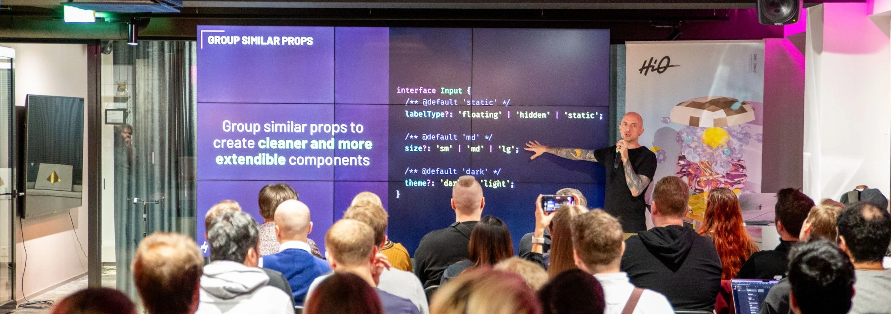

## Hey y'all 🤘 I'm Daniel.

> Frontend Development, Design Systems, HTML, CSS, JavaScript, TypeScript, React, Accessibility, UI/UX, Mentor, Empathy

Over 15 years ago, I began his career as a designer, before moving into frontend development. I've since taken that background in design and a passion for accessibility and moved into the realm of design systems. I'm an accessibility advocate, author, speaker, and a mentor at the Helsinki chapter of [CodeBar](https://codebar.io/) and [Hive Helsinki](https://www.hive.fi/en) coding school. You can also catch me sharing insights on platforms like [Smashing Magazine](https://www.smashingmagazine.com/author/daniel-yuschick/), [CSS Tricks](https://css-tricks.com/author/danyuschick/) and [LogRocket](https://blog.logrocket.com/author/danielyuschick/).

I'm most passionate about great chocolate, beautiful tattoos and bridging the gap between design and development to create accessible and resilient design systems.

### Speaking

| Date       | Event             | Location      |  Title                                                               |
| ---------- | ----------------- | ------------- | -------------------------------------------------------------------- |
| 05.12.2024 | Posti TechCon    | Helsinki, FI  |  Approach With Care - Making Digital Accessibility Feel Natural      |
| 18.12.2024 | Turku ❤️ Frontend | Turku, FI     | Beyond JavaScript - Building UIs With Modern HTML & CSS    |
| 27.02.2025 | axe-con     | Virtual  |  It's Alive! Facing The Monsters of Accessible Live Regions                                              |
| 28.05.2025 | Into Design Systems    | Virtual  |  TBD      |

### Past Speaking Events

| Date       | Event                          | Location        |  Title                                                               |
| ---------- | ------------------------------ | --------------- | -------------------------------------------------------------------- |
| 15.11.2024 | Build Stuff       | Vilnius, LT   |  Building Better Components — A Journey to a More Resilient Frontend |
| 02.11.2024 | Moldova DevCon    | Chișinău, MD  |  Approach With Care - Making Digital Accessibility Feel Natural      |
| 24.10.2024 | STHLM Xperience   | Stockholm, SE |  Approach With Care - Making Digital Accessibility Feel Natural      |
| 03.10.2024 | RenderCon                      | Nairobi, KE     |  Building Better Components — A Journey to a More Resilient Frontend |
| 02.10.2024 | Netlight                       | Helsinki, FI    |  Approach With Care - Making Digital Accessibility Feel Natural      |
| 11.07.2024 | TallinnJS                      | Tallinn, EE     |  Beyond JavaScript - Building UIs With Modern HTML & CSS     |
| 29.05.2024 | Hive Helsinki                  | Helsinki, FI    |  Approach With Care - Making Digital Accessibility Feel Natural      |
| 07.05.2024 | enterJS                        | Mainz, DE       |  The Keys to an Accessibility Mindset                                |
| 04.04.2024 | TampereJS                      | Tampere, FI     |  Building Better Components — A Journey to a More Resilient Frontend |
| 22.03.2024 | Michigan Technology Conference | Pontiac, MI, US |  The Keys to an Accessibility Mindset                                |
| 21.03.2024 | Michigan Technology Conference | Pontiac, MI, US |  Building Better Components — A Journey to a More Resilient Frontend |
| 29.02.2024 | HelsinkiJS                     | Helsinki, FI    |  Building Better Components — A Journey to a More Resilient Frontend |
| 28.02.2024 | Turku ❤️ Frontend              | Turku, FI       |  Building Better Components — A Journey to a More Resilient Frontend |
| 29.09.2023 | RenderCon Nairobi              | Nairobi, KE     |  The Keys to an Accessibility Mindset                                |
| 13.09.2023 | StackConf Berlin               | Berlin, DE      |  The Keys to an Accessibility Mindset                                |
| 31.05.2023 | Turku ❤️ Frontend              | Turku, FI       |  The Keys to an Accessibility Mindset                                |
| 04.05.2023 | TampereJS                      | Tampere, FI     |  The Keys to an Accessibility Mindset                                |
| 26.04.2023 | ResQ Club                      | Helsinki, FI    |  The Keys to an Accessibility Mindset                                |
| 04.04.2023 | Integrify                      | Helsinki, FI    |  The Keys to an Accessibility Mindset                                |
| 28.03.2023 | HelsinkJS                      | Helsinki, FI    |  The Keys to an Accessibility Mindset                                |
| 10.03.2023 | Meru Health                    | Helsinki, FI    |  The Keys to an Accessibility Mindset                                |
| 21.02.2023 | FiksuRuoka                     | Helsinki, FI    |  The Keys to an Accessibility Mindset                                |
